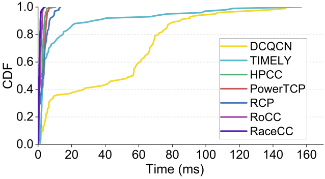
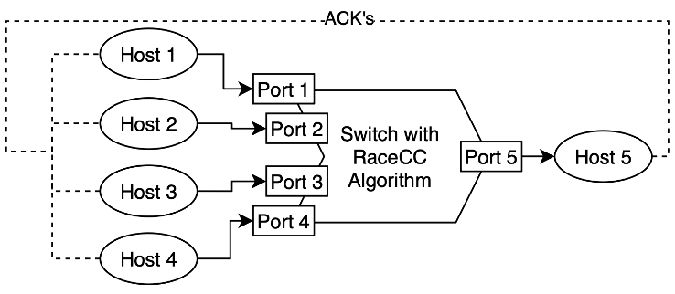
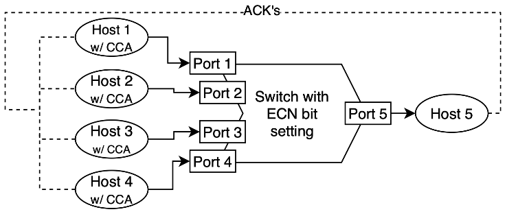
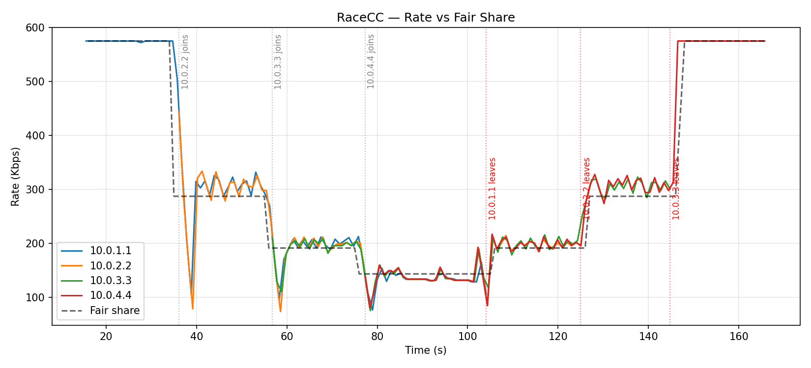
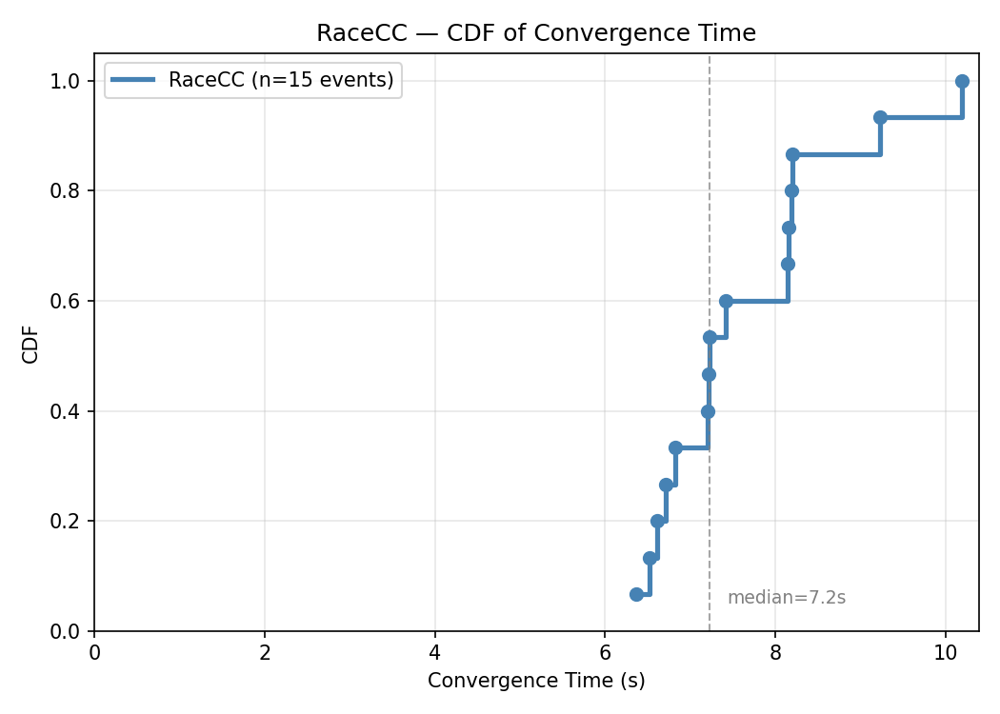
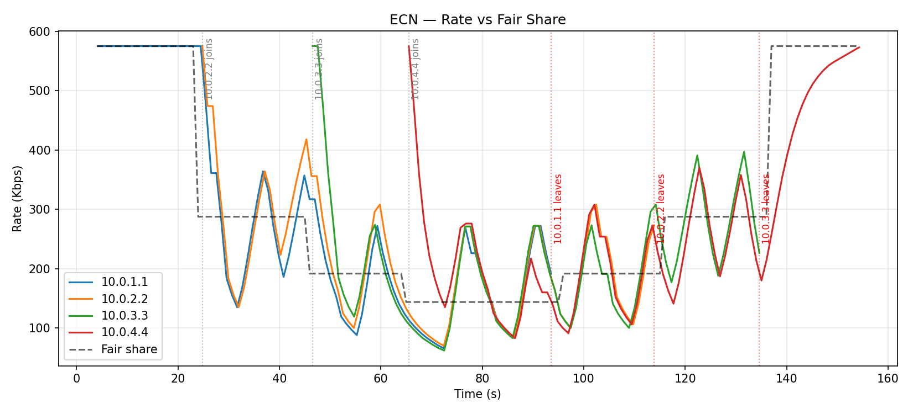
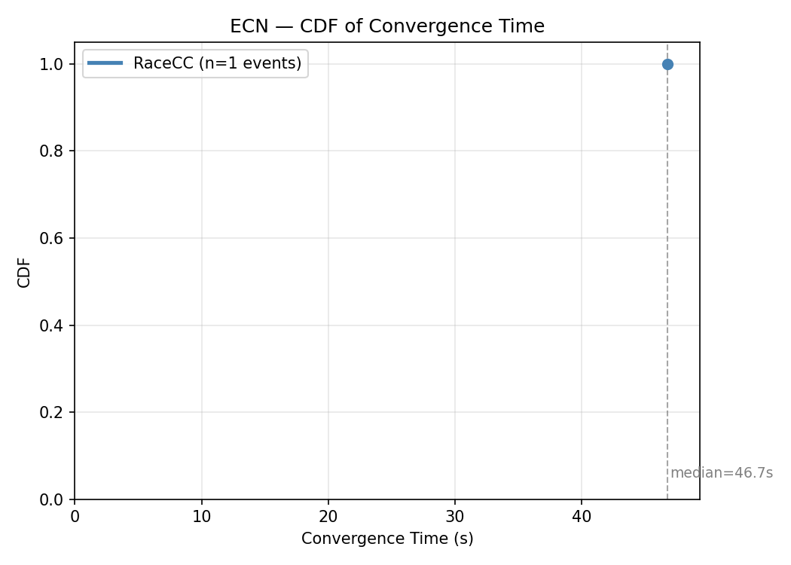

# RaceCC Replication - CIS 537

**Paper:** Shao et al., "RaceCC: A Rapidly Converging Explicit Congestion Control for Datacenter Networks," *Journal of Network and Computer Applications*, 217 (2023), 103673.

**Target claim:** Figure 7(c) - CDF of convergence time, showing that RaceCC converges significantly faster than host-driven CC's (HPCC, DCQCN, TIMELY, PowerTCP) and other switch-driven CC's (RCP, RoCC).


## Table of Contents

- [Introduction](#introduction)
- [Claim Being Reproduced](#claim-being-reproduced)
- [Original Methodology](#original-methodology)
- [Reproduction Methodology](#reproduction-methodology)
- [Results](#results)
- [Discussion](#discussion)
- [Lessons Learned](#lessons-learned)


## Introduction

Congestion control (CC) in datacenter networks attempts to achieve three goals: high link utilization, low queuing delay, and rapid convergence to fairness. Most deployed congestion control algorithms host-driven, meaning the switch signals congestion (via ECN, RTT, or in-network telemetry) and the sender reacts. These mechanisms perform well on utilization and latency but converge to fairness slowly, because each host reacts independently and blindly without knowing the rates of competing flows. Switch-driven CCA's take a different approach. Rather than signaling congestion and having the host calculate a new rate, the switch computes a fair rate directly and stamps it into packet headers. The receiving host forwards that new value back to the sender and the sender adjusts its rate. This allows for all flows through a bottleneck see the same rate signal, so the switch can be more accurate in adjusting rates.

RaceCC is a switch-driven congestion control algorithm designed to have low switch hardware requirements, require minimal queues, and converge quickly to fairness. Its key features are:

1. **Multiplicative Increase/Decrease (MIMD) rate adjustment with table lookups:** The switch approximates multiplicative increase/decrease by using a combination of integer addition and bit-shift operations, avoiding the floating-point and division operations required by other CCA's such as XCP.
2. **Additive Decrease (AD) for short queues:** When a small queue exists but is below the MD threshold, the switch subtracts a fixed value from the current fair rate rather than using multiplicative decrease. This helps avoid unnecessary oscillation.
3. **Alternating Measurement Cycle.** Rate increases are only applied at most once every other update interval, allowing one RTT for the rate change to propagate before the next measurement, which also helps decrease oscillation.
4. **No per-flow state.** The switch maintains one fair rate value per egress port, not per flow, which keeps resource usage to a minimum.

To prove that this proposed mechanism will remain stable as the number of flows grows, the authors performed a mathematical analysis to support their algorithm. The stability analysis shows the system is not at risk of destabilizing based on the number of flows and link bandwidth. Instead, the stability mainly depending on T (the update internal), η (the link utilization target), and γ (MD sensitivity). The paper recommends keeping η at 0.95 (95% link utilization) and γ between 0.1 and 0.3.

When the authors tested RaceCC against DCQCN, TIMELY, HPCC, PowerTCP, RCP, and RoCC using an NS-3 simulation, the results showed that RaceCC reduces average flow completion time by 20-57% and tail flow flow completion time by 15-63%. The results also showed that RaceCC was capable of converging to a fair rate value across flows within at most 2ms, faster than any of the other CCA's.


## Claim Being Reproduced



**Figure 7(c):** CDF of convergence time for different CC mechanisms

This figure above shows that the convergence time to a fair rate using RaceCC beats out the convergence times of both host-based CCA's (HPCC, DCQCN, TIMELY) and PI switch-based CCA's (RCP, RoCC) which require tens to hundreds of milliseconds. In the figure, nearly all RaceCC convergence events fall below 2 ms, while RCP and RoCC extend to 8-14 ms and host-driven schemes extend to 80-160 ms. The claim I am attempting to reproduce is that the algorithm implemented in RaceCC can acheive 2ms convergence as the paper shows. I will also be comparing RaceCC to a host-based method to see if RaceCC is superior at achieving convergence.

This claim was chosen because:

- It is the central contribution and claim of the paper.
- Testing convergence is relatively straightforward to measure.
- The testing procedure is agnostic from the system architecture so BMv2 can be used in place of NS-3, allowing for a more familiar setup.


## Original Methodology

The main CCA algorithm is a switch rate adjustment algorithm that runs every 10 μs. There are 3 separate rate altering mechanisms in the algorithm. They are:
- **MD (Multiplicative Decrease):** if queue depth is greater than a specified threshold, shift fair rate right by a certain number of bits. The amount of bit shifting that occurs is based on how larger the queue depth is. A lookup table is used to identify the number of bits to shift based on the queue size.
- **AD (Additive Decrease):** if the queue depth is above 0 but below the threshold, the fair rate has a fixed value subtracted from it.
- **MI (multiplicative increase):** if there is no queue and the fair rate is less than 95% of the link bandwidth, the new fair rate is calculated by adding the current fair rate + the current fair rate bit-shifted by a certain number of bits. The number of bits to shift is determined by the current fair rate value. A lower fair rate will allow for a more aggressive rate increase while a high fair rate requires a more conservative increase.

To communicate the fair rate between the switch and the sending host, the rate field is included as 17 bits in the IP header, identified by a custom IP protocol number. If no fair rate exists, the rate field will be initialized and the packet will be sent out. Once the switch receives the packets, the CCA will calculate the fair rate based on the mechanisms above. The packets fair rate field will get updated and then sent out on it's way to the receiving host. If the packet is sent through multiple switches, the fair rate will only be updated if the new rate is smaller than the current rate. This allows for the system to avoid congestion along the whole path of the packet. Once the packet is received by the end host, an ACK packet is sent back to the sender with the fair rate field included. The sender can then read the new rate value and update its sending rate.

To test this claim, the paper evaluates convergence using a single-bottleneck incast topology, where multiple senders are connected to a single receiver through a single switch. The experiment proceeds as:

1. n flows start and are allowed to converge and stabilize.
2. The number of incast senders changes from n to m where both values are randomly generated to be a value between 1 and 20.
3. Flows are considered converged when the rates differ by less than 10% from each other and the total link utilization is 95-100% of the bottleneck's bandwidth/ This must be maintained for at least 5 consecutive RTTs.

200 iterations of the experiment were conducted and the results were plotted as a CDF of convergence times as shown in Figure 7c.


## Reproduction Methodology

### Environment

Instead of using NS-3, the RaceCC reproduction runs on a P4/BMv2 in a Mininet environment. The topology consists of 4 sending hosts (h1-h4) sending packets to unique ingress ports on a single switch (s1). The packets are processed and sent to one receiving host (h5) through a single, common egress port.

### Protocol Design

To adapt the original methodology to BMv2, a custom IP protocol number, 0xFD, is used to identify packets as RaceCC packets. This allows for P4 to know to parse the custom racecc header. The header contains a single rate field and is appended to the packet after the IPv4 header. The packet structure is shown below:

```
Ethernet | IPv4 (proto=0xFD) | racecc_t { bit<32> rate } | payload
```

The RaceCC algorithm is implemented in the switch's egress control block. Multiple BMv2 registers are used to store persistent data between packets. Each register contains 8 indexes to account for a maximum of 8 different egress ports:
- `fair_rate` - the current fair rate in Kbps
- `tx_bytes` - the total number of bytes transmitted through an egress port
- `tx_bytes_last` - the total number of bytes transmitted through an egress port at the time of the last fair rate update
- `last_update` - timestamp of the last rate calculation
- `inc_flag` - a boolean flag to limit the fair rate to being updated at most once every other time the algorithm runs

Because the link capacity of BMv2 is limited to ~575 Kbps due to software limitation such as the time it takes for sendp() to run (18ms), the values used in the original paper had to be scaled down to account for the low packet throughput. 95% link utilization is now 546 Kbps, the update interval is now 100 ms, meaning the switch can only alter the fair rate at most 10 times a second. Also, the multiplicative decrease queue depth threshold is now 5 bytes. This is to allow for a quick response to any queue building because if the queue is allowed to build too much oscillation will prevent convergence. The additive decrease constant value is also set at 3Kbps to allow for mild corrections in the event of a very small queue.

The Increasing Factor Table from the original paper is also followed proportionally for the 575 Kbps link, however in the reproduction implementation the bit shifting is hard-coded as if statements as opposed to a lookup table:

| TX rate (Kbps) | < 109 | < 184 | < 270 | < 363 | < 437 | < 485 | < 516 | ≥ 516 |
|---|---|---|---|---|---|---|---|---|
| Inc factor (f_i) | −2 | −1 | 0 | 1 | 2 | 3 | 4 | 5 |

Next, The multiplicative decrease mechanism uses a set right bit-shift of 4 bit (≈ 6.25% reduction) when queue depth exceeds the MD threshold as using a variable bit shift value with the setups low throughput caused overshooting and then over-correction, leading to undesired oscillation and slow convergence times.


### Sender and Receiver

In the test setup, send.py runs on each of the 4 senders and implements packet rate throttling based on the current rate. Each packet is stamped with the current rate in the racecc header. A background sniffer thread listens for ACK packets from the receiver. When an ACK arrives, the current rate is updated to the rate echoed in the ACK's racecc field, which was originally set by the switch.

The receive.py script runs of the receiving host and sniffs all incoming RaceCC packets. It then logs elapsed time, source IP, rate, and packets per second to a CSV file once per second per packet. It then echoes each incoming packet back to its sender as an ACK with the racecc_t.rate field included.

### Experiment Design



To test this reproduction RaceCC implementation, each flow from the 4 sending hosts are started at 20 seconds apart. So h1 is started upon at 0 second, h2 is started at 20 seconds, h3 is started at 40 seconds, and h4 is started at 40 seconds. Each sender then transmits packets for 90 seconds straight. Each time a new flow is added or removed, this is considered a convergence event meaning that the time to convergence should be measured starting at the time the flow is added/removed. Five runs of this test were performed and the data is recorded as mentioned in the receive.py script.

Because of the sendp() software limitation it was necessary to manually set the throughput limit of the egress port to 55 packets per second in order to allow for a queue to build when multiple flows are active. To do this a CLI for the BMv2 instance was opened with the command 'sh simple_switch_CLI --thrift-port 9090'. From the CLI, the throughput is limited to 55 packets per second with the command 'set\_queue_rate 55 5'. 

Convergence for each join/leave event is measured by the plot_convergence.py script. To measure convergence, the script measures the time it takes for each flows rate to stay within 20% of the true fair rate given the number of flows. This threshold must be maintained for at least 5 consecutive packets. The highest flow convergence time for the event is used as the event's convergence time.

### Host-Based ECN Setup



To compare the RaceCC reproduction to a host-based congestion control algorithm, the Host\_Driven_ECN exercise was created. The difference from the RaceCC implementation is that in this setup, the switch mainly just forwards packets from sender to receiver and detects congestion based on queue length

As mentioned,the switch handles basic packet forwarding and ECN marking. It parses each packet's Ethernet, IPv4, and ECN header (protocol = 0xFE), which carries a rate field on the way to the receiver (so the receiver can record rate over time) and a congested flag. On the path to the destination, if a packet has ECN support enabled and the queue depth is at or above 5 packets, the switch sets the CE (Congestion Experienced) bits as a warning signal.

On the host side, each sender tracks the average number of CE-marked packets it receives compared to total packets received. This is the alpha value. A smoothing factor of 0.35. is used in order to weigh the ratio of recent congestion more than of past congestion. When congestion is detected, the sender cuts its rate multiplicatively. The aggressiveness of the cut depends on the current sending rate and the alpha value. When there is no congestion, it increases its rate in a similar fashion.

The same 4-flow testing scenario that was used to test RaceCC is also used here to allow for a direct comparison of convergence times.

### Divergences from Original Methodology

| Aspect | Paper | This Reproduction |
|---|---|---|
| Simulator | NS-3 | P4/BMv2 + Mininet |
| Link speed | 100 Gbps | 575 Kbps |
| Update interval T | 10 μs | 100 ms |
| # experiments | 200 random n→m transitions | 5 runs × 6 join/drop events = 30 events |
| Competitors | HPCC, DCQCN, TIMELY, PowerTCP, RCP, RoCC | Custom ECN Algorithm |
| Convergence criteria | All rates within 10%, aggregate 95-100% BW, 5 RTTs | All rates within 20% of fair share for 5 consecutive packets |
| Rate field placement | Custom IP header field | Custom IP protocol header (appended after IPv4) |
| RTT | ~12 μs | ~40 ms |
| Fair rate calculation | dynamic bit-shifting MD | static bit-shifting MD |

The most significant divergence from the original paper was the choice of simulator. BMv2 runs in software and its packet processing is a lot slower than NS-3. The 100 ms update interval was required because BMv2's packet throughput makes sub-millisecond updates impractical. Consequently, convergence times were measured in seconds rather than milliseconds.


## Results

### RaceCC - Rate vs. Fair Share

The figure below shows the rate reported by the switch to each of the four flows over the course of a single run. The dashed black line is the actual fair share value calculated as 95% convegence / # of flows.



Observations:
- Flow 1 (10.0.1.1) starts at full link rate (575 Kbps) and immediately drops when flow 2 joins. The switch converges both flows to ~287 Kbps within a few update cycles.
- Each join event causes a step rate decrease, followed by re-convergence at the new fair share.
- Low packet throughput leads to higher oscillation because the system has fewer opportunities to react.

### RaceCC - CDF of Convergence Time

The figure below combines all convergence events across all 5 runs into a single graph.



Across ~30 measured join/leave events, the median convergence time is approximately 3 to 6 seconds, with the worst case scenarios around 10 to 12 seconds.

### Host-Driven ECN Baseline - Rate vs. Fair Share



The host-driven comparison shows substantially slower convergence, if at all. When a new flow joins, the flow rates are slow to correct because the host-side algorithm only reacts more aggressively once the alpha value has grown larger. Also, it has trouble converging because by the time the congestion is gone the rates have dropped significantly. Then, the rates over-correct due to how low the rates have become. This cycle continues, leading to poor convergence results.

### Host-Driven ECN Baseline - CDF of Convergence Time



There is only one instance of the ECN CCA converging and it took over 45 seconds.

### Comparison to Original Figure 7(c)

The original paper's Figure 7(c) shows:
- **RaceCC:** CDF reaches 1.0 by ~2 ms
- **RCP / RoCC:** CDF reaches 1.0 by ~10-14 ms
- **HPCC / DCQCN / TIMELY / PowerTCP:** CDFs reaches 1.0 by ~80-160 ms.

This reproduction cannot match the millisecond timescale due to BMv2 software limitations. However, the RaceCC implementation does converge faster than the host-driven ECN implementation across the same number of join/leave scenarios which is loosely consistent with the relative results of the original paper.


## Discussion

### Why results differ

The primary throughput constraint identified during implementation was the sendp() function, which took approximately 18ms per packet to execute. At that rate, the sender is effectively capped at about 55 packets/second, regardless of what link speed is configured in Mininet. This is a host-side Python issue, not a switch or link limitation — the bottleneck is the time it takes Scapy to construct and inject each packet into the virtual interface.

The resulting effect is that the effective link utilization topped out well below the configured Mininet link capacity, and the system operated at hundreds of Kbps rather than the original Gbps-scale environment the paper described. At a 100ms update interval, each RaceCC feedback cycle takes around 100-200ms, so the 3-6 second median convergence times observed correspond to approximately 15-30 update cycles.


### What would be needed for a closer replication

To more closely reprode the result of Figure 7(c):
- A more capable software simulation or real hardware should be used to reach the full 100Gbps scale
- The update internal of the fair rate should also be decreased to match, so T should equal 10 μs
- The number of sending hosts at any given time should be randomized throughout the test run
- Stable comparison CCA's should be used to truly compare the RaceCC algorithm to current state-of-the-art


## Lessons Learned

**1. BMv2 isn't a perfect simulator when throughput is important:** P4/BMv2 is good for testing whether your data-plane and control-plane logic is correct, but it's the wrong tool if you're trying to get realistic packet throughout for a system. Packets are processed one at a time in software, and each packet takes an unrealistic amount of time before getting sent out. Any convergence times, queue depths, or throughput numbers you get will look very different from what you'd see on real hardware or in NS-3 because of this.

**2. The configurable parameters in the RaceCC algorithm make big differnce in convergence time:** The raceCC algorithm can be modified to alter things like how aggressive the fair rate is increased/decreased or how often the fair rate is recalculated. Tuning those parameters helped decrease the amount of oscillation, lowering the convergence times.

**3. RaceCC Switch-Based Algorithm did out perform a basic Host-Based CCA:** Even with the limitations of BMv2, the switch-based system was more intuitive to implement and behaved much better during testing. Because the switch is able to know the total amount of data flowing through it, it can accurately cut and increase the rate equally for all flows, leading to a more stable system.

